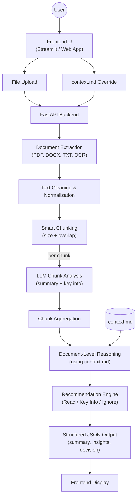

```mermaid
flowchart TD

    %% User Layer
    User((User)) --> UI

    %% UI Layer
    UI["`Frontend U
    (Streamlit / Web App)`"]
    UI --> Upload[File Upload]
    UI --> ContextInput[context.md Override]

    %% Backend Layer
    Upload --> API
    ContextInput --> API

    API[FastAPI Backend] --> Extract["`Document Extraction
    (PDF, DOCX, TXT, OCR)`"]
    Extract --> Clean[Text Cleaning & Normalization]
    Clean --> Chunk["`Smart Chunking
    (size + overlap)`"]
    
    %% AI Processing Layer
    Chunk -->|per chunk| LLMChunk["`LLM Chunk Analysis
    (summary + key info)`"]
    LLMChunk --> Combine[Chunk Aggregation]
    
    Combine --> LLMDoc["`Document-Level Reasoning
    (using context.md)`"]
    LLMDoc --> Decision["`Recommendation Engine
    (Read / Key Info / Ignore)`"]
    
    %% Output Layer
    Decision --> OutputJSON["`Structured JSON Output
    (summary, insights, decision)`"]
    OutputJSON --> UIOutput[Frontend Display]

    %% Configuration Layer
    ContextFile[(context.md)]
    ContextFile --> LLMDoc

```
